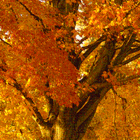

## Basic operations

### Resize image

```
(require '[clj-picasso.core :as picasso])

;; Load an image
(def image (picasso/load-from-path "path/to/image.png"))

;; Resize an image
(def resized-image (picasso/resize image 400 225))

;; Save resized image
(picasso/save-image resized-image "path/to/resized-image.png")
```

Output:


### Scale image

```
(require '[clj-picasso.core :as picasso])

;; Load an image
(def image (picasso/load-from-path "path/to/image.png"))

;; Scale image
(def scaled-image (picasso/scale image 2.0))

;; Save scaled image
(picasso/save-image scaled-image "path/to/scaled-image.png")
```

Output:


### Crop image

```
(require '[clj-picasso.core :as picasso])

;; Load an image
(def image (picasso/load-from-path "path/to/image.png"))

;; Crop image
(def cropped-image (picasso/crop image 200 200))

;; Save cropped image
(picasso/save-image cropped-image "path/to/grayscale-image.png")
```

Output:



### Rotate image

```
(require '[clj-picasso.core :as picasso])

;; Load an image
(def image (picasso/load-from-path "path/to/image.png"))

;; Rotate image
(def rotated-image (picasso/rotate image 180))

;; Save rotated image
(picasso/save-image rotated-image "path/to/rotated-image.png")
```

Output:


### Mirror image

```
(require '[clj-picasso.core :as picasso])

;; Load an image
(def image (picasso/load-from-path "path/to/image.png"))

;; Mirror image
(def mirrored-image (picasso/mirror image))

;; Save mirrored image
(picasso/save-image mirrored-image "path/to/mirrored-image.png")
```

Output:


### Generate random image

```
(require '[clj-picasso.core :as picasso])

;; Random image
(def random-image (picasso/generate-random-image 200 200))

;; Save random image
(picasso/save-image random-image "path/to/random-image.png")
```

Output:

