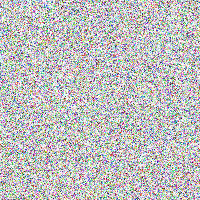

## Basic operations

First, you need to load the necessary namespaces:

```clojure
(ns user-ns.core
  (:require [clj-picasso.loading :refer :all]
            [clj-picasso.basic-operations :refer :all]))
```

Then load an image:

```clojure
;; Load an image
(def image (load-from-path "path/image.png"))
```

### Resize image

```clojure
;; Resize an image
(def resized-image (resize image 400 225))

;; Save output image
(save-image resized-image ".path/resized-image.jpg")
```

Example output:


### Scale image

```clojure
;; Scale an image
(def scaled-image (scale image 2))

;; Save output image
(save-image scaled-image "path/scaled-image.jpg")
```

Example output:


### Crop image

```clojure
;; Crop an image
(def cropped-image (crop image 200 200))

;; Save output image
(save-image cropped-image "path/cropped-image.jpg")
```

Example output:


### Rotate image

```clojure
;; Rotate an image
(def rotated-image (rotate image 180))

;; Save output image
(save-image rotated-image "path/rotated-image.jpg")
```

Example output:


### Mirror image

```clojure
;; Mirror an image
(def mirrored-image (mirror image))

;; Save output image
(save-image mirrored-image "path/mirrored-image.jpg")
```

Example output:


### Generate random image

```clojure
; Random image
(def random-image (generate-random-image 200 200))

; Save output image
(save-image random-image "path/random-image.jpg")
```

Example output:

