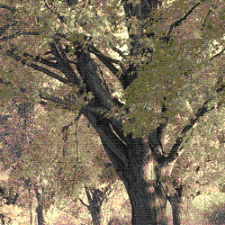

## Batch processing

First, you need to load the necessary namespaces:

```clojure
(ns user-ns.core
  (:require [clj-picasso.loading :refer :all]
            [clj-picasso.batch-processing :refer :all]))
```

### Example

```clojure
; Function for image processing
(defn process-image [^File image-file]
  (let [image (load-from-file image-file)
        cropped-image (crop-image image 0 0 250 250)
        mirrored-image (mirror-image cropped-image)
        sepia-image (filters/convert-to-sepia mirrored-image)
        output-path (.getParent image-file)]
    (save-image sepia-image (str output-path "/processed_" (.getName image-file)))))

; Process directory
(picasso/process-images-in-directory "path/" process-image)
```

Example outputs:



