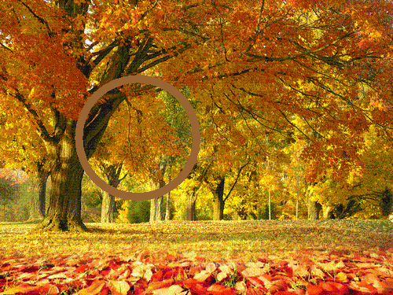

## Drawing

### Draw line on image

```
(require '[clj-picasso.core :as picasso])

;; Load an image
(def image (picasso/load-from-path "path/to/image.png"))

;; Draw line on image
(def output-image (drawing/draw-line image 100 175 400 175 10.0 "#b7ef7b"))

;; Save output image
(picasso/save-image output-image "path/to/output-image.png")
```

Output:


### Draw rectangle on image

```
(require '[clj-picasso.core :as picasso])

;; Load an image
(def image (picasso/load-from-path "path/to/image.png"))

;; Draw rectangle on image
(def output-image (drawing/rectangle image 20 20 200 100 10.0 "#000080"))

;; Save output image
(picasso/save-image output-image "path/to/output-image.png")
```

Output:


### Draw ellipse on image

```
(require '[clj-picasso.core :as picasso])

;; Load an image
(def image (picasso/load-from-path "path/to/image.png"))

;; Draw ellipse on image
(def output-image (drawing/draw-ellipse image1 100 100 150 150 10.0 "#8a7443"))

;; Save output image
(picasso/save-image output-image "path/to/output-image.png")
```

Output:

