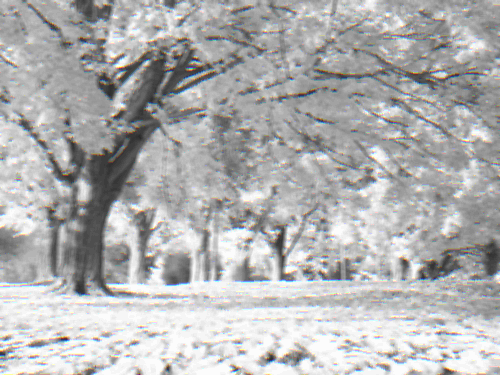

## Filters

First, you need to load the necessary namespaces:

```clojure
(ns user-ns.core
  (:require [clj-picasso.loading :refer :all]
            [clj-picasso.filters :refer :all]))
```

Then load an image:

```clojure
;; Load an image
(def image (load-from-path "path/image.png"))
```

### Apply grayscale filter

```clojure
;; Apply grayscale filter
(def grayscaled-image (apply-grayscale image))

;; Save grayscaled image
(save-image grayscaled-image "path/grayscale-image.png")
```

Output:


### Apply sepia filter

```clojure
;; Apply sepia filter
(def sepia-image (apply-sepia image))

;; Save sepia image
(save-image sepia-image "path/sepia-image.png")
```

Output:


### Apply negative filter

```clojure
;; Apply negative filter
(def negative-image (apply-negative image))

;; Save negative image
(save-image negative-image "path/negative-image.png")
```

Output:


### Apply one-channel filter

```clojure
;; Apply one-channel filter with "red" effect
(def red-image (apply-one-channel image "red"))

;; Save output image
(save-image red-image "path/red-image.png")
```

Output:


### Apply median filter

```clojure
;; Apply median filter
(def median-image (apply-median image 2))

;; Save median image
(save-image median-image "path/median-image.png")
```

Output:


### Apply blur filter

```clojure
;; Apply blur filter
(def blurred-image (apply-blur image 5))

;; Save blurred image
(save-image blurred-image "path/blurred-image.png")
```

Output:



### Adjust brightness

```clojure
;; Adjust brightness
(def output-image (adjust-brightness image 1.5))

;; Save output image
(save-image output-image "path/output-image.png")
```

Output:


### Adjust contrast

```clojure
;; Adjust contrast
(def output-image (adjust-contrast image 1.5))

;; Save output image
(save-image output-image "path/output-image.png")
```

Output:

