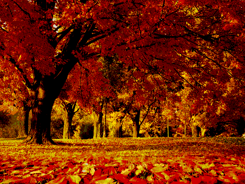

## Filters

### Apply grayscale filter

```
(require '[clj-picasso.core :as picasso])

;; Load an image
(def image (picasso/load-from-path "path/to/image.png"))

;; Apply grayscale filter
(def grayscaled-image (picasso/apply-grayscale image))

;; Save grayscaled image
(picasso/save-image grayscaled-image "path/to/grayscale-image.png")
```

Output:


### Apply sepia filter

```
(require '[clj-picasso.core :as picasso])

;; Load an image
(def image (picasso/load-from-path "path/to/image.png"))

;; Apply sepia filter
(def sepia-image (picasso/apply-sepia image))

;; Save sepia image
(picasso/save-image sepia-image "path/to/sepia-image.png")
```

Output:


### Apply negative filter

```
(require '[clj-picasso.core :as picasso])

;; Load an image
(def image (picasso/load-from-path "path/to/image.png"))

;; Apply negative filter
(def negative-image (picasso/apply-negative image))

;; Save negative image
(picasso/save-image negative-image "path/to/negative-image.png")
```

Output:


### Apply one-channel filter

```
(require '[clj-picasso.core :as picasso])

;; Load an image
(def image (picasso/load-from-path "path/to/image.png"))

;; Apply one-channel filter with "red" effect
(def output-image (picasso/apply-one-channel image "red"))

;; Save output image
(picasso/save-image output-image "path/to/output-image.png")
```

Output:


### Apply median filter

```
(require '[clj-picasso.core :as picasso])

;; Load an image
(def image (picasso/load-from-path "path/to/image.png"))

;; Apply median filter
(def median-image (picasso/apply-median image 2))

;; Save median image
(picasso/save-image median-image "path/to/median-image.png")
```

Output:


### Apply blur filter

```
(require '[clj-picasso.core :as picasso])

;; Load an image
(def image (picasso/load-from-path "path/to/image.png"))

;; Apply blur filter
(def blurred-image (picasso/apply-blur image 5))

;; Save blurred image
(picasso/save-image blurred-image "path/to/blurred-image.png")
```

Output:


### Adjust brightness

```
(require '[clj-picasso.core :as picasso])

;; Load an image
(def image (picasso/load-from-path "path/to/image.png"))

;; Adjust brightness
(def output-image (picasso/adjust-brightness image 1.5))

;; Save output image
(picasso/save-image output-image "path/to/output-image.png")
```

Output:


### Adjust contrast

```
(require '[clj-picasso.core :as picasso])

;; Load an image
(def image (picasso/load-from-path "path/to/image.png"))

;; Adjust contrast
(def output-image (picasso/adjust-contrast image 1.5))

;; Save output image
(picasso/save-image output-image "path/to/output-image.png")
```

Output:

