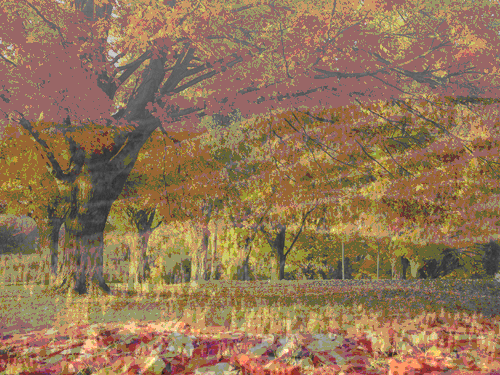

## Overlay

First, you need to load the necessary namespaces:

```clojure
(ns user-ns.core
  (:require [clj-picasso.loading :refer :all]
            [clj-picasso.overlay :refer :all]))
```

Then load images:

```clojure
;; Load first image
(def image1 (load-from-path "path/image1.png"))
;; Load second image
(def image2 (load-from-path "path/image2.png"))
```

### Overlay two images

```clojure
;; Overlay images
(def output-image (overlay-images image image2 0.5))

;; Save output image
(save-image output-image "path/output-image.png")
```

Output:

